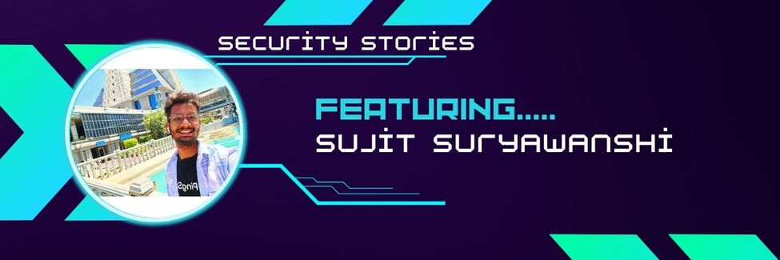

# SecurityStories - 52 Weeks, 52 Stories

## Story - 21: Featuring **Sujit Suryawanshi** 

Through the SecurityStories series, Today, we are excited to bring forward the story of Sujit Suryawanshi, who is an information security expert from India.

### **Question:** Could you briefly introduce yourself? 

**Sujit:** I have been working in information security from last 4+ years. I have good understanding of Application Security Processes, Exploiting and Researching Vulnerabilities, Security Best Practices, Threat Modeling and Information Security Strategy, Risk Assessments of Applications and Infrastructure. Currently, I'm working as Security Engineer in PayPal and I perform Penetration Testing, Vulnerability Assessment, Source Code Review of Web, Mobile, Network, Desktop, CLI Applications.

### **Question:** How did you get started in Cyber Security?

**Sujit:** I started hacking in college, and I was pretty much a script kiddie back then. I used to hack public wireless networks and I used to perform MITM, Phishing, Password Spraying attacks on social media/college accounts of friends as a part of pranks. Later on I got curiosity to know more about hacking and cracking, that's where I learn to crack games to cheat. Along with that, I did some research in security field and got to know about offensive security, penetration testing and all other stuff. 

### **Question:** What were the initial challenges and blockers you faced? 

**Sujit:** I didn't have a computer to learn more about security, so I used to perform most of the attacks on Raspberry Pi with Kali Nethunter and I didn't have any Wi-Fi at home, so I used to visit internet cafes in order to learn more and do some research about different types of vulnerabilities and attacks.

### **Question:** What learning methodology did you follow or still follow? 
**Sujit:** For learning different things in this field, I used to follow some people on the internet in order to learn more. I used to watch their YouTube videos, read blogs and articles about security. At that time, IRC was famous, so I used to have conversation about security stuff on IRC channels.

### **Question:** What all certifications do you hold, and what certificates would you recommend to the readers? 

**Sujit:** As of now, I hold CEH and Advanced Penetration Testing certificate. I will recommend readers to go for core level certificated such OffSec, SANS.

### **Question:** What is your favourite thing to hack on?

**Sujit:** My favorite thing to hack on is Web, Mobile and CLI as I get to play with code and memory of the applications.

### **Question:** What does your tool arsenal look like - Could you share some?

**Sujit:** Most of the time, I do things manually but yeah for automating security I use some tools such as amass, dirbuster, ffuf, httpx, nuclei, MobSF, BurpSuite etc.

### **Question:** How do you cope with Burn Outs?

**Sujit:s** When I feel burn out, I go outside, have a coffee, ride a bike, and sometimes I play video games as well.

### **Question:** What would you advise the newcomers in Cyber Security?
**Sujit:**  I would recommend newcomers to go for core security rather than just sticking with some basic stuff. There are n number of things to learn and discover in security. Learn more advanced stuff, If any exploit is working, analyze how it's working, what exactly happening in that particular MSF Module. Read more code and try to understand the logic behind it. Think out of the box while testing applications. Do research on Zero Days and their exploits. Automate processes to hunt vulnerabilities (especially zero days)

### **Question:** How do you keep up with the latest trends in Cyber Security - Could you share your go-to resources? 

**Sujit:** I follow Twitter, Telegram Channels, YouTube and Podcasts to keep myself updated with latest trends in Cyber Security. 

### **Question:** What's your life outside hacking?

**Sujit:** Outside of Hacking, I spend time with my family and friends more. I go on trekking, camping and riding with my friends. Apart from this, I like to visit different cafés to try out new food/drinks.

### Social Profiles

- LinkedIn: https://www.linkedin.com/in/codeh4ck3r
- Twitter: https://twitter.com/_codeh4ck3r

> Did you find Sujit's story interesting and inspiring? Please share it with your friends and colleagues to spread the word. 

> We will be coming up with more exciting and inspiring stories Weekly.

Follow Me on [Twitter](https://www.twitter.com/harshbothra_)